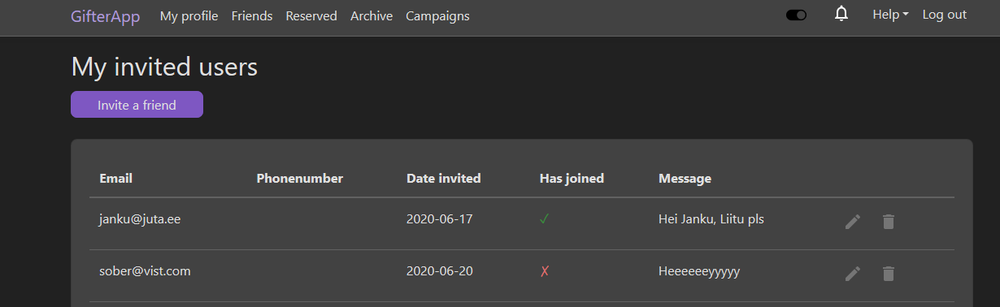
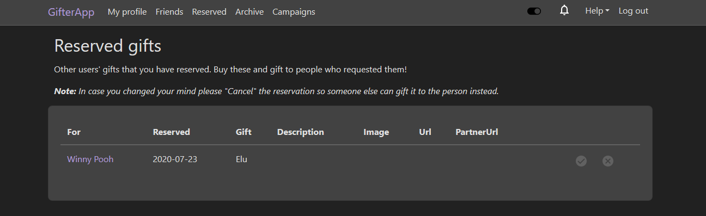

  <h1><code>GifterApp</code></h1>

  <strong>A social media platform dedicated to gift exhange between users and donation campaigns.</strong>

## 📚 About

### 🔧 Behind the project
* Started as a personal school project for the subject "ICD0009 Building Distributed Systems". Got a grade 5 (A).
* <strong>Back-end</strong> written in C# using .NET Core, Entity Framework (EF) and distributed architecture:
  * Domain - Database models
  * Data Access Layer (DAL) - Repositories and Unit of Work (UOW)
  * Business Logic Layer (BLL) - Services
  * Public layer - Public Data Transfer Objects (DTOs) and API Controllers using REST API
* Microsoft SQL Server (MSSQL) was used as a database
* JSON Web Token (JWT) was used for authorization
* Swagger was used for versioned API documentation
* Base packages uploaded and imported via NuGet
* <strong>Front-end</strong> client web application written using Aurelia framework and TypeScript
* <strong>Design</strong> currently implemented in plain CSS (will be changed to SASS or LESS).
* Both back-end and front-end were publicly hosted using Docker and Azure
* Created by Melissa Eenmaa, 2020

📃 NOTE: NEEDS REFACTORING! Especially regarding DRY principle. Many things were done quickly to meet the tight deadlines.

### 🏁 About the app
* Working features:
  * Registering & logging in
  * Theme toggle for the whole webpage (dark vs light)
  * Changing your profile info
  * Creating and changing a personal Wishlist with Gifts in it
  * Searching for users
  * Visiting other users' profiles
  * Adding or removing users as friends
  * Inviting new users to join
  * Reserving gifts (from other users' Wishlists), cancelling or gifting them
  * Archiving gifts (personal or others users'), reactivating or deleting them
  * Seeing all Campaigns and interacting with Donatees/their gifts
  * Creating new Campaigns and adding Donatees (only users with Campaign Manager role)

## 🚴 Usage

This App is publicly hosted but temporarily unavailable. 
Once it is available again the URL will appear here.

## :camera: Screenshots

### :house: Homepage
#### Not logged in

#### Logged in

### :dancer: :gift: Users & Gifts
#### Personal profile

#### Friend's profile

#### User search

#### User search results

#### Friendlist

#### Invited users

### Reserved gifts

### Archived gifts

### :gift_heart: Campaigns
#### All public

#### Personal

#### Donatees for specific Campaign

### :sun_with_face: Examples of the light theme
#### Homepage

#### Archived gifts

